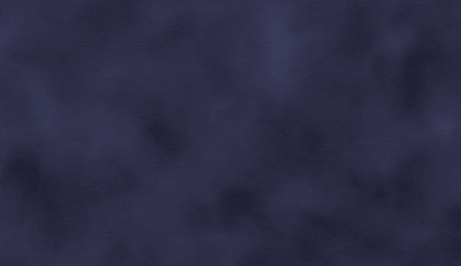

# Evermist

**English** · [Русский](README.ru.md)

An app for D&D: puts maps on a TV and adds **fog of war** that can be wiped away live from a second screen.



[](../../releases/latest)
[](../../releases/latest)
[](LICENSE)

Everything runs locally - one window stays on your laptop, the other goes out to a TV or projector for the players. The dungeon opens up gradually, as the party explores.

> **This is not a full VTT.** No tokens, no initiative tracker, no dice. Evermist does one thing - show a map and hide parts of it. But it does that part beautifully.

## What you can do

### Run two screens in sync

You get a DM window with all the controls, and a clean player window with no buttons and no cursor, just the map. Drag the player window to a TV or projector, hit fullscreen, and your players see only what you want them to.

Reveal a room on your laptop and it shows up on the TV instantly. Or switch to Manual mode, prep the next reveal in private, and push it with one button when the party walks through the door.

### Wipe away living fog of war

The fog is soft, with slowly drifting clouds, not a flat black fill. You uncover the map however suits the moment:

- **Brush** - wipe fog away by hand as the party moves.
- **Rectangle, Circle, Polygon** - carve out clean rooms and corridors in one stroke.
- **Reveal or Shroud** - a shape can uncover an area or hide it again, to close a door behind the party or drop them back into the dark.
- **Select** - every shape stays editable, so you can move or delete a reveal later.


### Maps that move

Drop in an animated map (MP4 or WebM, like an export from Dungeon Alchemist) and the water shimmers and the torches flicker, all of it playing live under the fog.


### Match the grid to your map

Switch between squares and hexes, then dial in size, offset, color, and opacity until it lines up with the map's own grid.

### Switch scenes mid-game

Save several maps and swap between them on the fly, with a smooth fade. The party leaves the tavern, the screen dissolves, and the dungeon fades in, all without breaking the mood.

### Built for big maps

Even a 10000×6000 map pans and zooms smoothly. Load the detailed stuff and don't think about it.

> **Tip:** press `?` in the DM window any time for the full list of keyboard shortcuts.

## Download

Grab the latest version from [**Releases**](../../releases/latest):

| System | File | Notes |
|--------|------|-------|
| Windows | `Evermist-<version>.exe` | Portable, no install needed, just runs |
| macOS | `Evermist-<version>.dmg` | Universal (Intel and Apple Silicon) |
| Linux | `Evermist-<version>.AppImage` | Make the file executable, then run |

Evermist is free and not code-signed (signing certificates cost money), so your OS shows a one-time security warning the first time you open it. It's harmless, here's how to get past it.

<details>
<summary>Getting past the first-launch warning</summary>

- **Windows:** if "Windows protected your PC" appears, click "More info", then "Run anyway".
- **macOS:** if "Evermist can't be opened because Apple cannot check it…" appears, right-click the app, choose "Open", then "Open" again in the dialog. (A normal double-click won't offer this the first time.)
- **Linux:** make the AppImage executable (`chmod +x Evermist-*.AppImage`, or Properties → Permissions → Allow executing file as program), then run it as usual.

The OS remembers your choice, so this only happens once.
</details>

## Running from source

No build step - it's plain JavaScript in an Electron shell.

```bash
npm install     # one-time, after cloning
npm start       # launch the app
```

Build an installer for the current platform:

```bash
npm run build         # Windows portable .exe
npm run build:mac     # macOS .dmg
npm run build:linux   # Linux AppImage
```

GitHub Actions builds all three platforms automatically on a `v*` tag push (see [`.github/workflows/release.yml`](.github/workflows/release.yml)).

## About map files

The map files (`.webm` / `.mp4`) and the app's data folder aren't part of the repo, they sit on disk next to the program. Cloning gives the code only. Maps get added through the app itself.

## Architecture

Curious how the fog rendering or the two-window sync works? See [ARCHITECTURE.md](docs/ARCHITECTURE.md) for a plain-language walkthrough.

## License

[MIT](LICENSE) - free to use, modify, and share.
