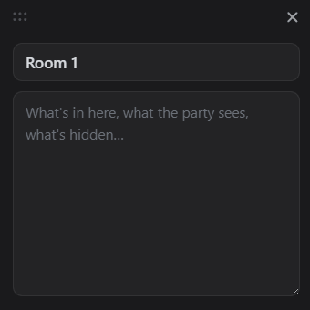
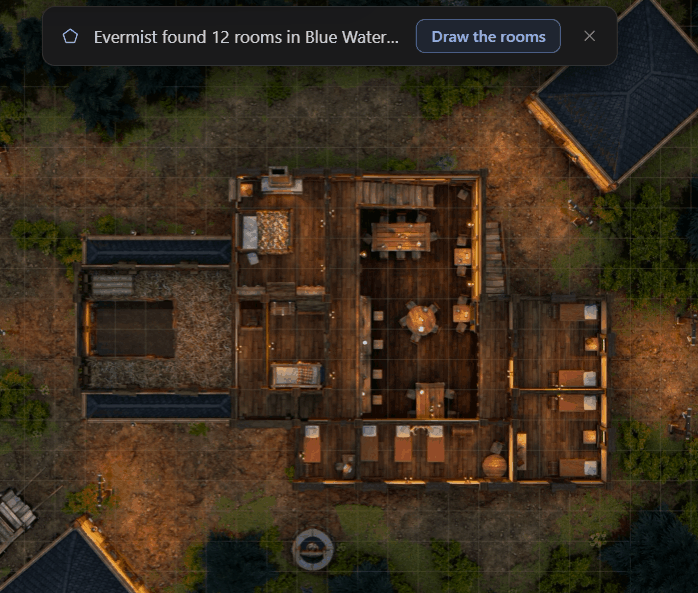
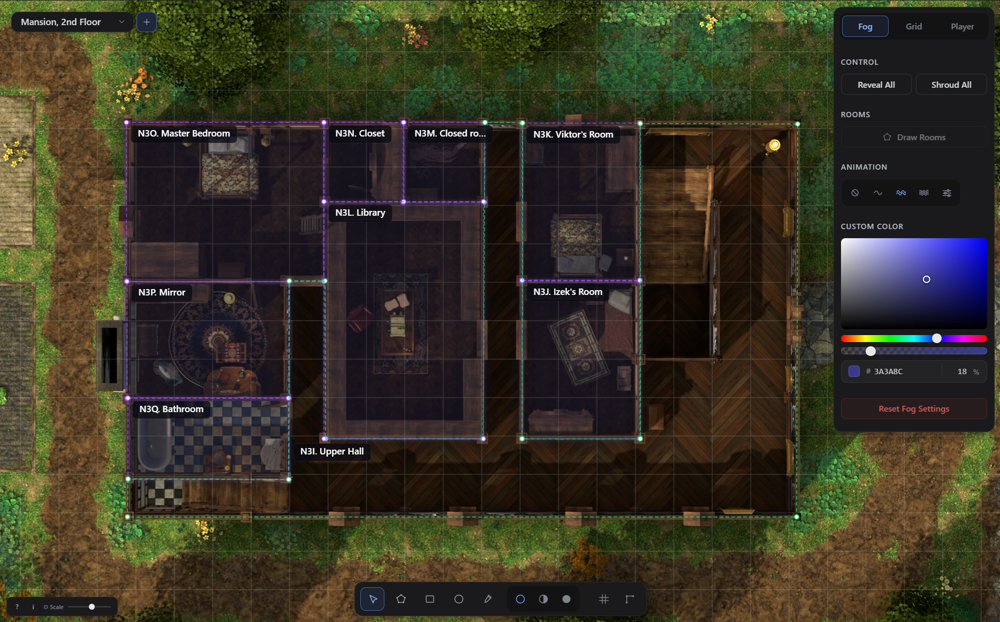
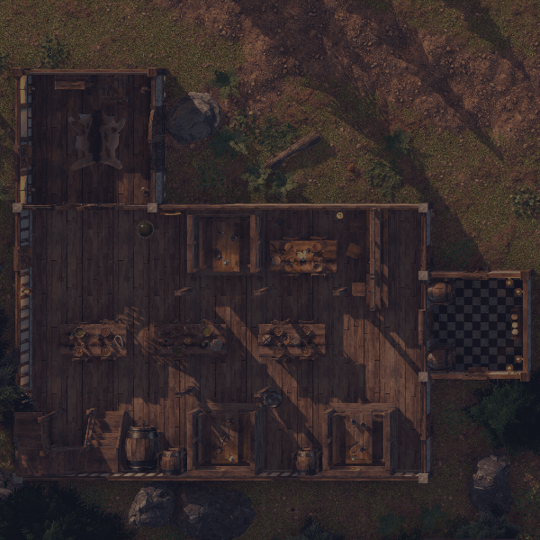
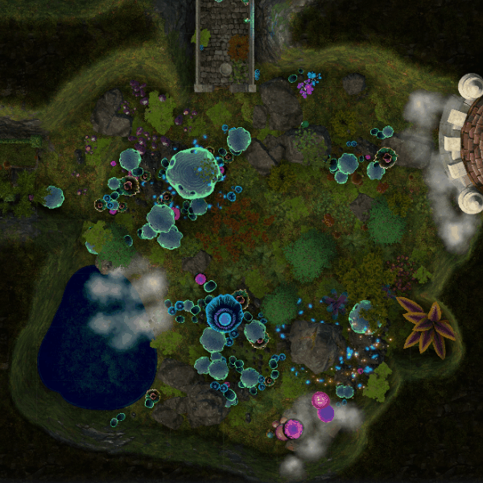

# Evermist

**English** · [Русский](README.ru.md)

[](../../releases/latest)
[](../../releases/latest)
[](LICENSE)

Evermist is for DMs who run TTRPGs in person. Your map goes on the TV, shrouded in fog of war that lifts as the party explores. It's free, and it always will be

Every room you draw gets a name and notes. Do the dungeon while you prep, and when the party kicks that door in, the room's name and notes are already on your laptop

> **This is not a VTT.** No tokens, no initiative, no dice, no character sheets. You run the game the way you always have. Evermist handles the map, and what the party knows about it


## Before the session

### Rooms with notes

Draw a room and the fog covers it. Click it and you get its name, your notes, and how much fog is sitting on it. A room is whatever you draw around, so a terrace or a stretch of corridor counts

Room names show up on your own map too, so you can open a floor you prepped three weeks ago and still know where you are. Everything saves itself as you go, so a half-explored dungeon stays that way until next session

### If you're running a published module

Load the module as `.txt` or `.pdf` and it reads out all the numbered locations: `K12. The Chapel`, and the other eighty-nine of them. Search it from any room's name field: type "chapel", pick the entry, and the name and notes fill in



### If it's all homebrew

Nothing to import, so you type the name and notes in yourself. Rooms can sit empty as long as you like, so you can draw a whole floor in one go and write it up later

### If your map came with a floor plan

If you make your own maps, your editor may be able to export the walls along with the image. Look for "Universal VTT" in the export options, which saves a `.dd2vtt` file next to the map. Load a map with one of those in the same folder and Evermist offers to draw all the rooms for you

Caves don't get drawn automatically. You get the buildings standing in them, and you draw the cave yourself



## At the table

### Your setup

You get a DM window with all the controls on it, and a clean player window with only the map, the fog and the grid. Your notes stay on your side

1. Run an HDMI cable to the TV and set your computer to extend the desktop. Nothing gets streamed, so the TV keeps up with you
2. Launch Evermist and load your map. Get the fog how you want it now, before anything reaches the TV
3. Open the Player window from the Player tab, drag it to the TV, then click Fullscreen
4. Play. Clear rooms as the party finds them and the TV follows you



### The fog

The fog drifts and slowly changes shape, so it looks like weather over the map

Every room is set to Revealed, Shrouded or Half-shrouded. Shrouded is what they haven't found yet, Revealed is where they're standing, and Half-shrouded is somewhere they've been but aren't in right now

You can move, reshape or delete a room at any point. Fog colour is set per scene: navy for a dungeon, green for a swamp, red when things have gone badly



### Animated maps

Load an MP4 or WebM and the water keeps moving and the torches keep flickering wherever the party has cleared the fog



## Everything else

- Manual mode, so you can set the next reveal up in private and send it with one button when they actually open the door
- A minimap on the right showing what part of the map is on the TV. Drag it to move the TV
- Square or hex grid. Size, offset, colour and opacity, so it lines up with the map's own grid
- Swap maps mid-game and the fog covers the change, so the screen never goes black
- A 10000×6000 map pans and zooms without complaining
- Export any set of scenes to one `.zip`, map files included, and restore it on another PC
- Optional snapping that pulls room corners to the grid, or straightens a wall you drew almost level

Press `?` in the DM window for the shortcut list

## What you need

A map. That's it, and any image or video file will do

The rest is optional and just makes prep faster:

| If you have | You get |
|---|---|
| Any PNG or JPG map | Fog, rooms, notes, grid, both screens. All of it |
| A published module as `.txt` or `.pdf` | Names and notes filled in from the book |
| An MP4 or WebM map | The map animates while the party looks at it |
| A `.dd2vtt` floor plan beside the map | Every room drawn for you, caves aside |

Rooms you draw by hand work the same as rooms drawn for you

## Download

Grab the latest version from [**Releases**](../../releases/latest):

| System | File | Notes |
|--------|------|-------|
| Windows | `Evermist-<version>.exe` | Portable, no install needed, just runs |
| macOS | `Evermist-<version>.dmg` | Universal (Intel and Apple Silicon) |
| Linux | `Evermist-<version>.AppImage` | Make the file executable, then run |

Evermist isn't code-signed (signing certificates cost money), so your OS shows a one-time security warning the first time you open it. It's harmless

<details>
<summary>Getting past the first-launch warning</summary>

- **Windows:** if "Windows protected your PC" appears, click "More info", then "Run anyway"
- **macOS:** if "Evermist can't be opened because Apple cannot check it…" appears, right-click the app, choose "Open", then "Open" again in the dialog. (A normal double-click won't offer this the first time.)
- **Linux:** make the AppImage executable (`chmod +x Evermist-*.AppImage`, or Properties → Permissions → Allow executing file as program), then run it as usual

The OS remembers your choice, so this only happens once
</details>

## Nothing leaves your computer

No account, no cloud, no network traffic. Evermist runs with the wifi switched off

Your maps and scenes sit on your own disk. Module PDFs get read in a separate locked-down process that can't touch your files

## Running from source

No build step. It's plain JavaScript in an Electron shell

```bash
npm install     # one-time, after cloning
npm start       # launch the app
```

Build an installer for the current platform:

```bash
npm run build         # Windows portable .exe
npm run build:mac     # macOS .dmg
npm run build:linux   # Linux AppImage
```

GitHub Actions builds all three platforms automatically on a `v*` tag push (see [`.github/workflows/release.yml`](.github/workflows/release.yml))

## Architecture

Want to know how the fog rendering or the two-window sync works? [ARCHITECTURE.md](docs/ARCHITECTURE.md) explains it in plain English

## License

[MIT](LICENSE) - free to use, modify, and share
